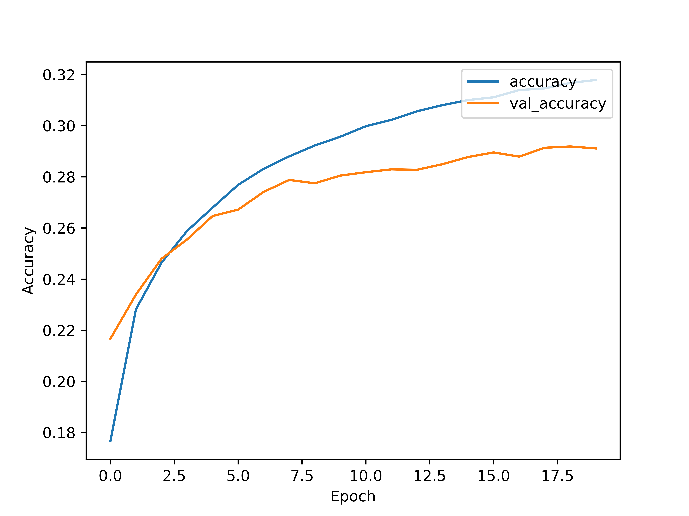
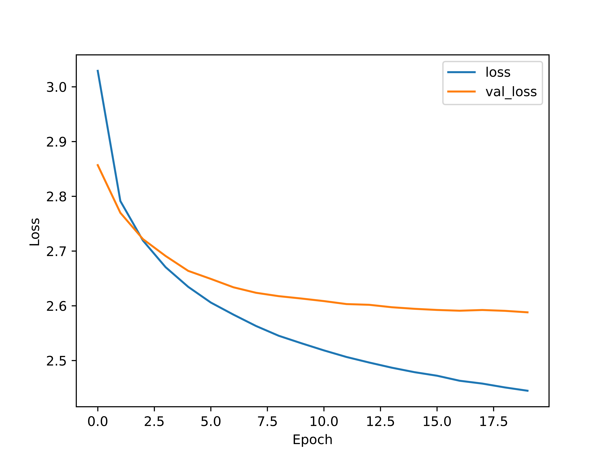

# DEEP CTF. CTF Team Name Generator 🚀

So, you're looking for a name for your CTF team? You've come to the right place! This is an evening project I did to generate some names for my team, however I thought it might be useful for others as well. So here it is! 🔥

## How to use

1. Clone the repo: `git clone https://github.com/m4drat/deep-ctf`
2. Train the model: `python3 deep_ctf.py --train --model_path name_generator.h5`
3. Or just generate some names using the pre-trained model: `python3 deep_ctf.py --generate --num_names 10 --model_path name_generator.h5`

## How it works

The model is a simple GRU network with 2 hidden layers, trained on a dataset of 30'000+ CTF team names. The number of training epochs is around 60 in total, and the model was trained in 3 stages.

Some examples of generated names:

```txt
h4ck3r_p0w3r
noobsquad
zer0team
shell rooot
chickensec
the black coder
cyb3rshell
team_1337
n00bst3am
cyber_shadow
```

And a few accuracy/loss graphs:

<p align="center">
    
</p>
<p align="center">
    
</p>
